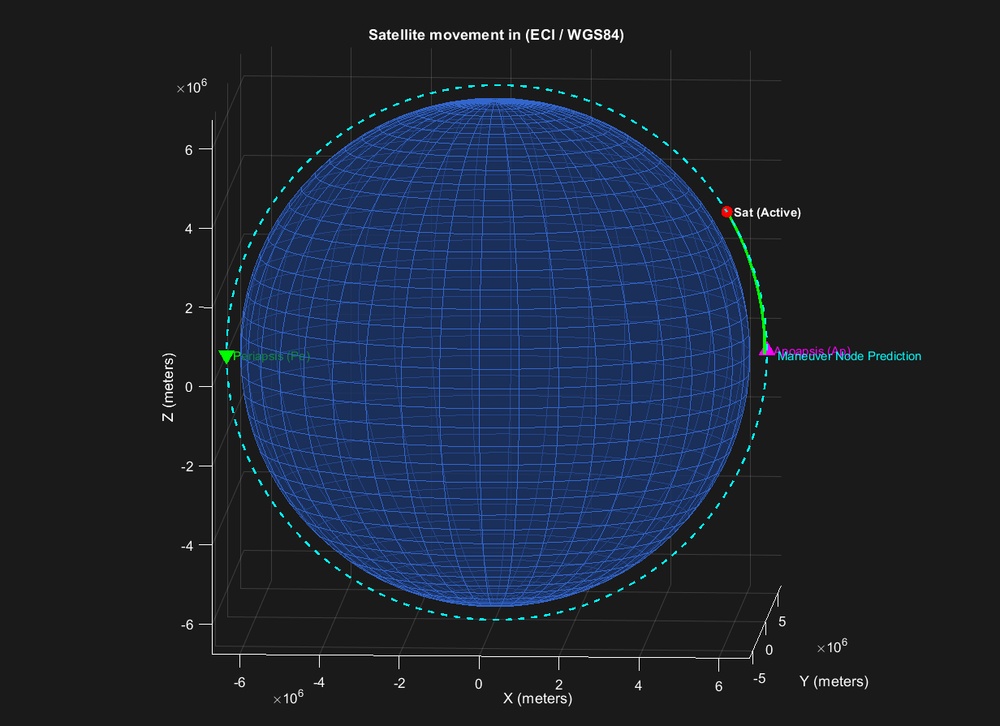

# HIL Testbed for Autonomous Spacecraft GNC with $J_2$ Orbital Perturbations and Coupled Attitude-Trajectory Dynamics

## Project Overview
This repository contains a full-stack, high-fidelity **Hardware-in-the-Loop (HIL)** simulation testbed developed for a 3U CubeSat satellite. The project implements a closed-loop co-simulation between a high-precision **MATLAB 3D Orbital Mechanics and ADCS Engine** and an external **STM32 Hardware Board** acting as an embedded On-Board Computer (OBC) flight software and GNC safety interlock.

The system autonomously plans, coordinates, and executes a rigorous **three-impulse autonomous orbital mission**:
1. **Phase 1 (Altitude Restoration):** Prograde aerodynamic drag compensation to raise the pericenter.
2. **Phase 2 (Plane Change):** Cross-track impulsive maneuver at the latitude nodes to rotate the orbital plane into a polar orbit ($90^\circ \pm 1^\circ$).
3. **Phase 3 (Circularization):** Retrograde burn strictly within the true anomaly pericenter window to counteract eccentricity inflation and circularize the final polar orbit.

---

## How to Run & Execute

The simulator features an autonomous hybrid engine. It executes out-of-the-box on vanilla MATLAB setups via Software-in-the-Loop (SIL) mode, or hooks into an embedded microcontroller via Hardware-in-the-Loop (HIL) mode without any re-compilation or physical wiring changes.

### 1. Quick Start: Pure Software Simulation (SIL Mode)
If you do not have the physical STM32 microcontroller and embedded rig, the platform automatically runs a pure mathematical co-simulation benchmark:
1. Clone this repository to your local workstation:
   ```bash
   git clone https://github.com/TexLingon/hil-satellite-gnc-with-j2-orbital-perturbations.git
   ```
2. Open MATLAB and navigate to the project root directory.
3. Open `control_center.m`.
4. Locate the configuration section at the top of the file and verify that the hardware request is bypassed or let the auto-fallback engage:
   ```matlab
   USE_PHYSICAL_HARDWARE = 0;
   ```
5. Click **Run**. The system will instantly launch the 3D orbit visualization globe, engage the 4D Sheppard attitude tracking, and successfully execute all three operational phases of the polar insertion mission entirely in software.

### 2. Embedded Execution: Hardware-in-the-Loop (HIL Mode)
To run the full cyber-physical verification pipeline with real-time hardware constraints:
1. Flash your physical **STM32** development board with the provided bare-metal C flight software code (configured for UART DMA circular buffering at `9600` baud).
2. Connect the STM32 board to your workstation using a USB-to-UART bridge (FTDI, CP2102, or onboard ST-LINK VCP).
3. Identify the operating system virtual port assigned to the board (e.g., `COM3` on Windows or `/dev/ttyUSB0` on Linux/macOS).
4. Open `control_center.m` in MATLAB and configure the hardware deployment variables:
   ```matlab
   USE_PHYSICAL_HARDWARE = 1;
   com_port = 'COM3';
   baud_rate = 9600;
   ```
5. Click **Run**. The Mission Control Station will establish a synchronous physical communication frame over the serial bus.

*Note on Hot-Plugging:* If you unplug the hardware USB cable during mid-burn maneuvers, the flight manager will throw a terminal notification and instantly hot-swap to the SIL mathematical model to secure propagation. Re-inserting the cable automatically triggers target dynamic deserialization and restores true HIL tracking on the fly.

### 3. Firmware Compilation & Flashing (STM32 Node)
The embedded flight software is developed using the **PlatformIO** ecosystem inside **Visual Studio Code**, utilizing the bare-metal **STM32Cube HAL** framework. The primary target microcontroller used for real-time cyber-physical verification is the **STM32F103C8T6 (Blue Pill)**.

To compile and flash the firmware onto the micro-controller:
1. Open **VS Code** and ensure the **PlatformIO IDE** extension is installed.
2. Click **Open Project** and navigate to the `flight-software/` directory inside this repository (where `platformio.ini` is located).
3. PlatformIO will automatically parse the configuration file and download the required toolchains. Verify your `platformio.ini` contains the target environment layout:
   ```ini
   [env:bluepill_f103c8]
   platform = ststm32
   board = bluepill_f103c8
   framework = stm32cube
   upload_protocol = stlink ; Change to serial/blackmagic depending on your debugger
   ```
4. Connect your **ST-LINK V2** (or alternative programmer) to the STM32F103C8T6 board using the standard SWD pinout (`GND`, `3V3`, `SWDIO`, `SWCLK`).
5. Click the **PlatformIO: Build** checkmark icon in the status bar to verify error-free compilation of the bare-metal C safety interlock gates and CRC-8 validation threads.
6. Click the **PlatformIO: Upload** arrow icon to flash the compiled binary onto the microcontroller ROM.
7. Connect the target microcontroller USART1 pins (`PA9` for TX, `PA10` for RX) to your workstation's USB-to-UART bridge to engage the active real-time HIL simulation loop.

---

## Part 1: Orbital Mechanics & Translational 3D Dynamics

The translational motion of the spacecraft's center of mass is modeled in the **Earth-Centered Inertial Coordinate System (ECI)** over the non-spherical Earth geoid. The absolute acceleration vector $\mathbf{a}$ is governed by non-central gravitational potentials, continuous upper-atmosphere aerodynamic friction, and low-thrust propulsion:

$$\mathbf{a} = \mathbf{a}_{Newton} + \mathbf{a}_{J2} + \mathbf{a}_{drag} + \mathbf{a}_{thrust}$$

### 1. Non-Central Gravitational Potential ($J_2$ Zonal Harmonic)
Real Earth flattening at the poles creates a gravitational equatorial bulge. This oblateness is modeled via the second zonal harmonic $J_2$, leading to continuous orbital precession (nodal regression). The acceleration perturbations in ECI coordinates ($x, y, z$) are derived as:

$$a_{J2\_x} = -\frac{3}{2} J_2 \left(\frac{\mu}{r^2}\right) \left(\frac{R_{eq}}{r}\right)^2 \left(1 - 5\left(\frac{z}{r}\right)^2\right) \frac{x}{r}$$

$$a_{J2\_y} = -\frac{3}{2} J_2 \left(\frac{\mu}{r^2}\right) \left(\frac{R_{eq}}{r}\right)^2 \left(1 - 5\left(\frac{z}{r}\right)^2\right) \frac{y}{r}$$

$$a_{J2\_z} = -\frac{3}{2} J_2 \left(\frac{\mu}{r^2}\right) \left(\frac{R_{eq}}{r}\right)^2 \left(3 - 5\left(\frac{z}{r}\right)^2\right) \frac{z}{r}$$

Where $J_2 = 1.08262668 \times 10^{-3}$, $R_{eq} = 6378137.0 \text{ m}$ (WGS84 Semimajor Axis), and $r = \sqrt{x^2 + y^2 + z^2}$ is the absolute geocentric radius.

### 2. Aerodynamic Drag Model
The continuous altitude decay inside the lower thermosphere is governed by atmospheric friction. The drag acceleration vector is anti-parallel to the velocity vector:

$$\mathbf{a}_{drag} = -\frac{1}{2} \rho v_{mag}^2 \frac{C_d A}{M} \cdot \mathbf{1}_v$$

* $\rho = \rho_0 \exp\left(-\frac{h - h_0}{H}\right)$ represents the exponential atmospheric density scale ($\rho_0 = 1.588 \times 10^{-11} \text{ kg/m}^3$ at $h_0 = 400 \text{ km}$, scale height $H = 50 \text{ km}$).
* $C_d = 2.2$ is the spacecraft drag coefficient.
* $A = 0.01 \text{ m}^2$ is the cross-sectional area, $M = 1.33 \text{ kg}$ is the satellite mass.

### 3. Propulsive Thrust Vectoring Model (3D Direction Cosine Matrix)
When the On-Board Computer (OBC) triggers active maneuvers (`cmd_maneuver = 1`) and confirms the attitude alignment criterion (`alignment_factor > 250`), the main propulsion unit ignites. Unlike simplified planar tracking setups, the low-thrust engine vector is tightly coupled to the spacecraft's instantaneous spatial orientation. 

The thrust acceleration vector $\mathbf{a}_{thrust}$ in the Earth-Centered Inertial (ECI) frame is mapped from the spacecraft's body-fixed thrust vector $\mathbf{T}\_B = [a\_{\text{thrust}\_\text{mag}}, 0, 0]^\top$ via a complete orthogonal 3D **Direction Cosine Matrix (DCM)** derived from the active attitude quaternion $\mathbf{q}$:

$$\mathbf{a}_{thrust} = \mathbf{DCM}(\mathbf{q}) \cdot \mathbf{T}_B$$

The dynamic transformation tensor $\mathbf{DCM}(\mathbf{q}) \in SO(3)$, which inherently accounts for simultaneous pitch, yaw, and roll coupling without singularities, is evaluated at each micro-step as:

$$\mathbf{DCM}(\mathbf{q}) = \begin{bmatrix} 1.0 - 2.0(q_2^2 + q_3^2) & 2.0(q_1 q_2 - q_0 q_3) & 2.0(q_1 q_3 + q_0 q_2) \\ 2.0(q_1 q_2 + q_0 q_3) & 1.0 - 2.0(q_1^2 + q_3^2) & 2.0(q_2 q_3 - q_0 q_1) \\ 2.0(q_1 q_3 - q_0 q_2) & 2.0(q_2 q_3 + q_0 q_1) & 1.0 - 2.0(q_1^2 + q_2^2) \end{bmatrix}$$

$$\begin{bmatrix} a_{thrust\_x} \\ a_{thrust\_y} \\ a_{thrust\_z} \end{bmatrix} = \mathbf{DCM}(\mathbf{q}) \begin{bmatrix} \frac{T_{thrust}}{M} \\ 0 \\ 0 \end{bmatrix}$$

Where $T_{thrust} = 0.6 \text{ N}$, mass $M = 1.33 \text{ kg}$ represents the low-thrust utilized to execute rapid orbital geometry alterations.

### 4. Numerical Orbital Propagation
To capture the true coupled translational-rotational flight envelope without numerical phase lag, the system discards low-order integrators in favor of a manual, deterministic **Classical Runge-Kutta 4th Order (RK4) algorithm** with a fixed macro-step $\Delta t = 1.0\,\text{s}$. The complete spacecraft state is integrated as a synchronous 13-dimensional monolithic vector $\mathbf{S}(t) \in \mathbb{R}^{13}$ containing inertial positions, velocities, orientation quaternions, and body-fixed angular rates:

$$\mathbf{S}(t) = \begin{bmatrix} x & y & z & v_x & v_y & v_z & q_0 & q_1 & q_2 & q_3 & \omega_x & \omega_y & \omega_z \end{bmatrix}^\top$$

The continuous system of differential equations is governed by the state derivative function $\mathbf{F}(\mathbf{S}) = \frac{d\mathbf{S}}{dt}$, tracking 3D Newtonian gravitation, non-central $J_2$ forces, continuous upper-atmosphere drag, 3D propulsive thrust allocation, and nonlinear dynamic rigid body Euler torques:

$$\mathbf{F}(\mathbf{S}) = \left[ \begin{aligned} &v_x \\\\ &v_y \\\\ &v_z \\\\ &-\frac{\mu x}{r^3} + a_{\text{J2}_x} + a_{\text{drag}_x} + a_{\text{thrust}_x} \\\\ &-\frac{\mu y}{r^3} + a_{\text{J2}_y} + a_{\text{drag}_y} + a_{\text{thrust}_y} \\\\ &-\frac{\mu z}{r^3} + a_{\text{J2}_z} + a_{\text{drag}_z} + a_{\text{thrust}_z} \\\\ &\frac{1}{2}\left(-\omega_x q_1 - \omega_y q_2 - \omega_z q_3\right) \\\\ &\frac{1}{2}\left(\omega_x q_0 - \omega_y q_2 + \omega_z q_3\right) \\\\ &\frac{1}{2}\left(\omega_y q_0 - \omega_z q_1 - \omega_x q_3\right) \\\\ &\frac{1}{2}\left(\omega_z q_0 + \omega_y q_1 - \omega_x q_2\right) \\\\ &\left((J_y - J_z)\omega_y\omega_z + M_{\text{ctrl}_x}\right)/J_x \\\\ &\left((J_z - J_x)\omega_z\omega_x + M_{\text{ctrl}_y}\right)/J_y \\\\ &\left((J_x - J_y)\omega_x\omega_y + M_{\text{ctrl}_z}\right)/J_z \end{aligned} \right]$$

At each simulation epoch, the plant evaluates four high-frequency predictive intermediate stages ($\mathbf{k}_1 \dots \mathbf{k}_4$) to compute the symmetric weighted average of the state trajectory updates:

$$\mathbf{k}_1 = \mathbf{F}(\mathbf{S}(t))$$

$$\mathbf{k}_2 = \mathbf{F}\left(\mathbf{S}(t) + \frac{\Delta t}{2}\mathbf{k}_1\right)$$

$$\mathbf{k}_3 = \mathbf{F}\left(\mathbf{S}(t) + \frac{\Delta t}{2}\mathbf{k}_2\right)$$

$$\mathbf{k}_4 = \mathbf{F}(\mathbf{S}(t) + \Delta t \mathbf{k}_3)$$

$$\mathbf{S}(t + \Delta t) = \mathbf{S}(t) + \frac{\Delta t}{6}\left(\mathbf{k}_1 + 2\mathbf{k}_2 + 2\mathbf{k}_3 + \mathbf{k}_4\right)$$

This implementation strictly ensures full kinematic-translational coupling within the stage steps. It completely eliminates the numerical drift inherent to decoupled solvers, providing a highly stable real-time verification baseline for the embedded GNC flight computer.

## Part 2: Rigid Body Attitude Kinematics & Angular Dynamics

The rotational motion of the 3U CubeSat is decoupled from its orbital position computation but completely dictates the directional steering of the physical thrust vector. The angular state profile combines **nonlinear Euler’s rotational equations of motion** (dynamic block) with **continuous unitary quaternion integration** (kinematic block).

### 1. Asymmetric Rigid Body Angular Dynamics (Euler's Equations)
The satellite is modeled as an asymmetric rigid body with a non-diagonal inertia tensor. The continuous angular acceleration vector $\dot{\boldsymbol{\omega}} = [\dot{\omega}\_x, \dot{\omega}\_y, \dot{\omega}\_z]^T$ evaluated inside the spacecraft's local body-fixed frame ($B$) is highly coupled due to cross-product gyroscopic torques and active reaction wheel control moments $\mathbf{M}_{ctrl}$:

$$\dot{\omega}_x = \frac{(J_y - J_z)\omega_y\omega_z + M_{ctrl\_x}}{Jx}$$

$$\dot{\omega}_y = \frac{(J_z - J_x)\omega_z\omega_x + M_{ctrl\_y}}{Jy}$$

$$\dot{\omega}_z = \frac{(J_x - J_y)\omega_x\omega_y + M_{ctrl\_z}}{Jz}$$

Where the nominal structural moments of inertia are set to $Jx = 2.0$, $Jy = 2.5$, and $Jz = 3.0 \text{ kg}\cdot\text{m}^2$. The cross-coupling terms $(J_i - J_j)\omega_i\omega_j$ model the physical transfer of angular momentum between axes during rapid 3D slews, which the control system must dynamically counteract.

### 2. Quaternion Kinematics (Right-Handed Hamiltonian Standard)
Attitude integration is driven by a four-dimensional unit quaternion vector $\mathbf{q} = [q_0, q_1, q_2, q_3]^T$, where $q_0$ represents the scalar part (cosines of the half-rotation angle) and $\mathbf{q}_{vec} = [q_1, q_2, q_3]^T$ represents the imaginary spatial vector part. 

The precise kinematic time-derivative $\dot{\mathbf{q}}$ is implemented using the **right-handed Hamiltonian convention**. This ensures exact alignment with the spatial cross-product error formulation and eliminates coordinate inversion errors:

$$\dot{q}_0 = \frac{1}{2} \left( -\omega_x q_1 - \omega_y q_2 - \omega_z q_3 \right)$$

$$\dot{q}_1 = \frac{1}{2} \left( \omega_x q_0 - \omega_z q_2 + \omega_y q_3 \right)$$

$$\dot{q}_2 = \frac{1}{2} \left( \omega_y q_0 + \omega_z q_1 - \omega_x q_3 \right)$$

$$\dot{q}_3 = \frac{1}{2} \left( \omega_z q_0 - \omega_y q_1 + \omega_x q_2 \right)$$

### 3. High-Frequency Unitary Norm Enforcement
Due to finite numerical differentiation over time, discrete floating-point integration steps introduce a slow inflation or deflation of the quaternion's mathematical length. Since only a unitary quaternion ($\|\mathbf{q}\| = 1.0$) lies on the $S^3$ manifold and represents a pure physical rotation, a strict norm enforcement constraint is executed at the end of every high-frequency sub-step:

$$\mathbf{q}_{normalized} = \frac{\mathbf{q}}{\sqrt{q_0^2 + q_1^2 + q_2^2 + q_3^2}}$$

This normalization prevents coordinate degradation, ensuring that the 3D PID controller and the Direction Cosine Matrix (DCM) always receive mathematically clean and non-divergent rotation parameters.

## Part 3: High-Frequency Sub-Stepping 3D Control Loop

The GNC flight controller operates inside a **20 Hz sub-stepping physics integrator ($dt_{sub} = 0.05 \text{ s}$)**. This allows the low-thrust ADCS reaction wheels to compute reactive control torques capable of stabilizing the satellite against cross-coupling gyroscopic loads generated by the main propulsion unit.

### 1. Attitude Parameter Extraction (Row-Based Sheppard's Algorithm)
The guidance logic derives the Local Vertical Local Horizontal (LVLH) frame by tracking the geocentric position and velocity vectors: $\mathbf{k}\_{\text{lvlh}} = \frac{-\mathbf{r}}{\lvert\mathbf{r}\rvert}$ (Nadir), $\mathbf{j}\_{\text{lvlh}} = \frac{(\mathbf{k} \times \mathbf{v})}{\lvert\mathbf{k} \times \mathbf{v}\rvert}$ (Binormal), and $\mathbf{i}_{\text{lvlh}} = \mathbf{j} \times \mathbf{k}$ (Velocity transversal). 

To extract the target flight command quaternion $\mathbf{q}_{\text{target}}$ from the dynamic orthonormal matrix $\mathbf{R}\_{\text{mat}}$ without experiencing the trigonometric singularities or divisions-by-zero inherent to Euler angle conversions, the OBC executes a robust, four-branch **Row-Based Sheppard’s Algorithm**. 

The flight software dynamically evaluates the trace of the guidance matrix ( $\text{Tr}(\mathbf{R}\_{\text{mat}})$ ) and the magnitudes of its diagonal elements to choose the mathematically dominant quaternion component, maximizing floating-point precision across the entire $360^\circ$ spatial envelope:

$$\begin{aligned} \text{Tr}(\mathbf{R}\_{\text{mat}}) &= R_{11} + R_{22} + R_{33} \end{aligned}$$

$$\mathbf{q}_{\text{target}} = \left[ \begin{aligned} 
&\text{\bf{Branch 1: If }} \text{Tr}(\mathbf{R}_{\text{mat}}) \gt 0 \text{ (Scalar Dominant)} \\\\
&\quad S = 2.0 \cdot \sqrt{\text{Tr}(\mathbf{R}_{\text{mat}}) + 1.0} \\\\
&\quad \mathbf{q}_{\text{target}} = \begin{bmatrix} 0.25 \cdot S & \frac{R_{23} - R_{32}}{S} & \frac{R_{31} - R_{13}}{S} & \frac{R_{12} - R_{21}}{S} \end{bmatrix}^\top \\\\
&\text{\bf{Branch 2: If }} R_{11} \gt R_{22} \land R_{11} \gt R_{33} \text{ (X-Axis Dominant)} \\\\
&\quad S = 2.0 \cdot \sqrt{1.0 + R_{11} - R_{22} - R_{33}} \\\\
&\quad \mathbf{q}_{\text{target}} = \begin{bmatrix} \frac{R_{23} - R_{32}}{S} & 0.25 \cdot S & \frac{R_{12} + R_{21}}{S} & \frac{R_{13} + R_{31}}{S} \end{bmatrix}^\top \\\\
&\text{\bf{Branch 3: If }} R_{22} \gt R_{33} \text{ (Y-Axis Dominant)} \\\\
&\quad S = 2.0 \cdot \sqrt{1.0 + R_{22} - R_{11} - R_{33}} \\\\
&\quad \mathbf{q}_{\text{target}} = \begin{bmatrix} \frac{R_{31} - R_{13}}{S} & \frac{R_{12} + R_{21}}{S} & 0.25 \cdot S & \frac{R_{23} + R_{32}}{S} \end{bmatrix}^\top \\\\
&\text{\bf{Branch 4: Otherwise (Z-Axis Dominant)}} \\\\
&\quad S = 2.0 \cdot \sqrt{1.0 + R_{33} - R_{11} - R_{22}} \\\\
&\quad \mathbf{q}_{\text{target}} = \begin{bmatrix} \frac{R_{12} - R_{21}}{S} & \frac{R_{13} + R_{31}}{S} & \frac{R_{23} + R_{32}}{S} & 0.25 \cdot S \end{bmatrix}^\top
\end{aligned} \right]$$

This branch-switching logic shifts the divisor $S$ away from zero zones into the maximum absolute value manifold, guaranteeing complete numerical stability during aggressive out-of-plane maneuvers.

### 2. Conjugate Quaternion Error Manifold Extraction
To enforce strict coordinate alignment across arbitrary large-angle turns without experiencing trigonometric blind spots (such as roll-axis unwinding), the guidance logic discards spatial vector projections. Instead, the flight computer continuously maps attitude deviations onto the local $S^3$ hypersphere manifold by evaluating a full 4D **Conjugate Quaternion Multiplicative Error ($\mathbf{e}_{quat}$)**:

$$\mathbf{e}_{quat} = \mathbf{q} \otimes \mathbf{q}_{\text{target}}^{-1}$$

To protect the actuation loop from executing a catastrophic $360^\circ$ flip when crossing the 4D hemisphere boundary, the sign of the target state is dynamically adjusted using a geodesic dot-product check:

$$\zeta = \text{sign}\left(\mathbf{q} \cdot \mathbf{q}_{\text{target}}^\top\right), \quad \zeta \in \{-1, 1\}$$

Applying the sign-flip modifier ($\mathbf{q}\_t = \mathbf{q}_{\text{target}} \cdot \zeta$), the precise spatial error components ($e_0, e_x, e_y, e_z$) are computed through explicit Hamiltonian quaternion cross-multiplication:

$$e_0  =  q_0 q_{t0} + q_1 q_{t1} + q_2 q_{t2} + q_3 q_{t3}$$

$$e_x = -q_0 q_{t1} + q_1 q_{t0} - q_2 q_{t3} + q_3 q_{t2}$$

$$e_y = -q_0 q_{t2} + q_2 q_{t0} - q_3 q_{t1} + q_1 q_{t3}$$

$$e_z = -q_0 q_{t3} + q_3 q_{t0} - q_1 q_{t2} + q_2 q_{t1}$$

Where $e_0 = \cos(\theta_{\text{error}}/2)$ acts as the pure scalar tracking margin, and $\mathbf{e}_{\text{vector}} = [e_x, e_y, e_z]^\top$ represents the imaginary spatial orientation error vector passed directly into the multi-axis PID controller channels.

### 3. Non-Blind 4D Manifold Telemetry Digitization (Hamilton Gate)
Standard GNC configurations isolate telemetry sensors, leading to unobservable actuator faults during cross-axis coupling. To guarantee total fault tolerance, the OBC telemetry digitization layer evaluates the absolute magnitude of the 4D scalar error component ($|e_0|$). This ensures that any misalignment across pitch, roll, or yaw instantly depresses the tracking index:

$$\alpha_{\text{align}} = \text{uint8}\left(|e_0| \cdot 255\right)$$

The propulsion array interlock on the external microcontroller reads this unified byte directly. Active firing is inhibited if $\alpha_{\text{align}} \le 250$, guaranteeing that the engine cannot ignite or pulse until the attitude loops have stabilized the satellite down to an orientation accuracy margin of $\approx 98\%$.

### 4. Feed-Forward Augmented 3D PID Control Allocation
The commanding reaction wheel control moments $\mathbf{M}_{\text{ctrl}}$ are calculated simultaneously across all three body axes. To prevent the differential damping loop from fighting the natural angular motion of the Local Vertical Local Horizontal (LVLH) orbit frame during real-time flight tracking, the derivative block utilizes a **Velocity Feed-Forward (FF)** compensation layer:

$$\boldsymbol{\omega}_{\text{orbit}\_\text{ECI}} = \frac{\mathbf{r} \times \mathbf{v}}{\|\mathbf{r}\|^2}, \quad \boldsymbol{\omega}_{\text{orbit}\_\text{body}} = \mathbf{DCM}(\mathbf{q}) \cdot \boldsymbol{\omega}_{\text{orbit}\_\text{ECI}}$$

The discrete multi-variable control allocation operates on the relative body rate ($\boldsymbol{\omega}\_{\text{rel}} = \boldsymbol{\omega} - \boldsymbol{\omega}\_{\text{orbit}\_\text{body}}$) combined with conditional integration (*Anti-Windup protection*) to mitigate saturation during aggressive maneuvers:

$$\mathbf{e}_{\text{int}}(t + \Delta t_{\text{sub}}) = \begin{cases} \mathbf{e}_{\text{int}}(t) + \mathbf{e}_{\text{vector}}(t) \cdot \Delta t_{\text{sub}}, & \text{if } \max(|e_x|, |e_y|, |e_z|) \lt 0.1 \\ \begin{bmatrix} 0 & 0 & 0 \end{bmatrix}^\top, & \text{otherwise} \end{cases}$$

$$\mathbf{e}_{\text{int}\_\text{clamped}} = \max(-\mathbf{M}_{\text{int}\_\text{max}}, \min(\mathbf{M}_{\text{int}\_\text{max}}, \mathbf{e}_{\text{int}}))$$

$$\mathbf{M}_{\text{ctrl}} = K_p \mathbf{e}_{\text{vector}} + K_d \boldsymbol{\omega}_{\text{rel}} + K_i \mathbf{e}_{\text{int}\_\text{clamped}}$$

$$\begin{bmatrix} M_{{ctrl\_x}} \\ M_{{ctrl\_y}} \\ M_{{ctrl\_z}} \end{bmatrix} = \begin{bmatrix} K_p e_x + K_d \omega_{{rel\_x}} + K_i e_{{int\_{clamped\_x}}} \\ K_p e_y + K_d \omega_{{rel\_y}} + K_i e_{{int\_{clamped\_y}}} \\ K_p e_z + K_d \omega_{{rel\_z}} + K_i e_{{int\_{clamped\_z}}} \end{bmatrix}$$

Where the optimized control gains are set to $K_p = -1.15$, $K_d = -1.65$, and $K_i = -0.01$, with the torque saturation limits rigidly governed at $\mathbf{M}_{\mathrm{int\_max}} = 0.05\,\text{N}\cdot\text{m}$.

## Part 4: Multi-Phase Orbital Guidance State Machine

The translational guidance logic operates as an autonomous Finite State Machine (FSM) inside the Flight Director architecture. To achieve maximum fuel efficiency and combat highly non-linear orbital distortions, the guidance subsystem dynamically transitions between three distinct operational phases based on filtered Keplerian parameters and relative angular tracking metrics.

### 1. Mean Altitude Navigation Filter (Phase 1 Trigger)
Due to the Earth's non-spherical mass distribution ($J_2$), a satellite on a inclined orbit undergoes severe high-frequency geometric radius oscillations of up to $\pm 50 \text{ km}$ every half-orbit, even when maintaining a constant kinetic energy profile. Evaluating the orbital safety margin based on instantaneous radius vectors causes catastrophic false prograde triggers. 

To circumvent this gravitational ripple, the guidance engine executes a predictive mean altitude filter ($\bar{h}_{pred}$) evaluated over a full propagated passive (ballistic coasting) orbit vector $\mathbf{X}_p$ containing $N$ integrated discrete steps:

$$\bar{h}_{pred} = \frac{1}{N} \sum_{i=1}^{N} \left( \sqrt{X_{p\_x}(i)^2 + Y_{p\_y}(i)^2 + Z_{p\_z}(i)^2} - R_{eq} \right)$$

* **Phase 1 Activation:** If $\bar{h}\_{\text{pred}} \lt 351{,}000\,\text{m}$ or instantaneous altitude $h < 350{,}000 \text{ m}$, the FSM commands a continuous prograde burn ($\mathbf{R}\_{\text{mat}} = [\mathbf{i}\_{\text{lvlh}}^\top, \mathbf{j}\_{\text{lvlh}}^\top, \mathbf{k}\_{\text{lvlh}}^\top]^\top$) to inject kinetic energy into the orbit.
* **Phase 1 Cutoff:** As soon as the predictive mean altitude filter confirms the future orbit has been safely cleared from the dense atmospheric drag zone ($\bar{h}_{pred} > 353,000 \text{ m}$), propulsion is immediately cut off to minimize propellant consumption.

### 2. Latitude Node Burn Window (Phase 2 Inclination Steering)
To optimize the change in inclination toward the polar orbit without experiencing execution halts, the flight manager bypasses traditional nodal impulse windows. Instead, the GNC architecture commands a **Continuous Inertial Cross-Track Steering** manifold. 

The primary spacecraft longitudinal engine axis ($\mathbf{X}\_B$) is locked directly along the negative orbital momentum binormal ($\mathbf{j}\_{\text{lvlh}}$) to maximize the out-of-plane torque efficiency. Concurrently, to eliminate attitude singularities and mathematical gymbal-lock during polar pass transits, the auxiliary transverse reference axes are cross-stabilized against the fixed inertial Earth-Centered Inertial (ECI) vernal equinox vector ($\mathbf{X}\_{\text{ECI}} = [1, 0, 0]^\top$):

$$\mathbf{X}\_{B} = -\mathbf{j}\_{\text{lvlh}}$$

$$\mathbf{Y}\_{B} = \frac{\mathbf{X}\_{B} \times \mathbf{X}\_{\text{ECI}}}{\|\mathbf{X}\_{B} \times \mathbf{X}\_{\text{ECI}}\|}$$

$$\mathbf{Z}\_{B} = \mathbf{X}\_{B} \times \mathbf{Y}\_{B}$$

The command guidance frame alignment matrix $\mathbf{R}\_{\text{mat}}$ is dynamically constructed in a monolithic, orthonormal space as follows:

$$\mathbf{R}\_{\text{mat}} = \left[ \begin{aligned} &\mathbf{X}\_{B}^\top \\\\ &\mathbf{Y}\_{B}^\top \\\\ &\mathbf{Z}\_{B}^\top \end{aligned} \right]$$

The main propulsion unit operates continuously throughout this phase (`cmd_maneuver = 1`). The 4D Sheppard algorithm feeds the relative attitude errors directly into the reaction wheels, maintaining a solid inertial orientation that drives the orbital inclination to the targeted $90.00^\circ$ baseline with maximum precision.

### 3. Relative True Anomaly Pericenter Pulsing (Phase 3 Circularization)
To eliminate execution delays caused by the rapid regression of the lines-of-apsides under non-central $J_2$ forces where impulsive braking shifts the geometric pericenter behind the vehicle and induces premature engine cutoffs the guidance loop implements a hybrid **Radial Velocity Gate ($v_{\text{rad}}$)** co-integrated with a wide true anomaly cosine window ($\cos \nu$):

$$v_{\text{rad}} = \frac{\mathbf{r} \cdot \mathbf{v}}{\|\mathbf{r}\|}$$

The propulsive state triggers the thruster vector strictly inside the low-energy orbital tangent manifold, shifting dynamically between angular and pure kinematic constraints:

$$\mathrm{cmd\_maneuver} = \left[ \begin{aligned} &1, \quad \text{if} \quad (\cos \nu \gt 0.88) \lor (v_{\text{rad}} \gt 0 \land v_{\text{rad}} \lt 180.0\,\text{m/s}) \\\\ &0, \quad \text{else} \end{aligned} \right]$$

This mathematical optimization extends propulsive execution into the post-pericenter exit arc. Firing is sustained while the vehicle begins its upward radial ascent but maintains a low altitude expansion rate ($v_{\text{rad}} < 180.0\,\text{m/s}$). This locks the retrograde ignition on during the most effective orbital braking window, draining excess kinetic energy and driving the apoapsis peak down to the targeted $365\,\text{km}$ circular boundary with absolute numeric immunity to apsis-flipping anomalies.

## Part 5: Embedded Flight Software Architecture & Serial Telemetry Bridge

The On-Board Computer (OBC) subsystem is executed on a physical ARM Cortex-M3 microcontroller (STM32) running bare-metal C flight software. It performs as a high-reliability hardware interlock and real-time telemetry decoder, synchronizing the mathematical state vectors with physical hardware states.

### 1. Deterministic Fixed-Size Telemetry Protocol
To optimize bus utilization over the full-duplex USB-UART bridge operating at **9600 baud**, the system avoids heavy text-based encodings or variable-length bitmasks. Instead, it utilizes strict, decoupled fixed-size binary packets with direct byte mapping to ensure consistent execution timing:

* **Command/Request Frame (PC ➔ OBC, 11 Bytes):**
  * `altitude_wgs84` - `float` (4 Bytes) - Filtered WGS84 altitude.
  * `simulation_time` - `uint32_t` (4 Bytes) - Macro-simulation epoch counter.
  * `alignment_factor` - `uint8_t` (1 Byte) - Active 3D spatial alignment metric ($0 \dots 255$).
  * `cmd_maneuver` - `uint8_t` (1 Byte) - Operational FSM phase flag ($0/1$).
  * `crc8` - `uint8_t` (1 Byte) - Frame validation checksum.

* **Feedback/Response Frame (OBC ➔ PC, 7 Bytes):**
  * `mcu_time` - `uint32_t` (4 Bytes) - Echoed simulation time for network synchronization verification.
  * `engine_state` - `uint8_t` (1 Byte) - Active physical propulsion ignition status ($0/1$).
  * `adcs_state` - `uint8_t` (1 Byte) - Active reaction wheel actuation status ($0/1$).
  * `crc8` - `uint8_t` (1 Byte) - Feedback validation checksum.

### 2. Asynchronous UART DMA Ring Buffer Architecture
To enforce strict real-time execution bounds and eliminate data packet drops or bus latency jitter, the incoming data stream on the STM32 OBC is decoupled from the main CPU execution thread. 

The flight software configures the Universal Synchronous Asynchronous Receiver Transmitter (USART) peripheral to stream incoming data directly into a local memory stack using **Direct Memory Access (DMA) in Circular Mode**. The incoming bytes slide through a rolling 11-byte hardware ring window:

$$\mathbf{B}_{ring}(t) = [b_0, b_1, \dots, b_{10}]^T$$

Upon every byte arrival, the window shifts left asynchronously without triggering CPU interrupts, completely eliminating transmission overhead. The validation layer extracts the payload from the ring buffer only when a valid frame footprint is registered by the mathematical checksum decoder.

### 3. Cyclic Redundancy Check (CRC-8 Polynomial Validation)
Data integrity across the full-duplex serial interface is governed by a software-implemented Cyclic Redundancy Check (CRC-8) routine executed on both the PC and OBC nodes. The protection algorithm treats the binary payload vector as a polynomial message $M(x)$ and divides it by a standard ATM communication generator polynomial $G(x) = x^8 + x^2 + x^1 + 1$ (represented by the hexadecimal byte mask `0x07`):

$$CRC8 = \text{Remainder}\left( \frac{M(x) \cdot x^8}{G(x)} \right)$$

The validation routine sequentially processes the packet data array through a series of bitwise exclusive-OR (XOR) and bit-shift steps. If the computed remainder matches the final received packet byte ($b_{10}$), the frame is processed by the flight director layers; otherwise, the frame is flagged as corrupt and discarded to prevent transient bus noises from feeding garbage commands into the actuators.

### 4. Real-Time Hardware GNC Attitude Safety Interlock
The microcontrolled flight software acts as the definitive critical safety shield for the satellite's propulsion array. Real-world thruster activation while a satellite is tumbling or misaligned can severely distort the orbit or destabilize the vehicle permanently.

To enforce this protection, the OBC decodes the `alignment_factor` byte ($\alpha_{\text{align}} \in [0, 255]$) computed on the PC by assessing the spatial 3D angle of the vehicle's thrust vector against the current target vector. The microcontroller executes a rigid boolean hardware interlock gate:

$$\mathit{engine\_state} = \begin{cases} 1, & \text{if } (\mathit{cmd\_maneuver} == 1) \land (\alpha_{\text{align}} > 250) \\ 0, & \text{otherwise} \end{cases}$$

If the satellite satisfies the orientation gate ($\alpha_{\text{align}} > 250$, representing an accuracy threshold of $\approx 98\%$ spatial alignment), the OBC sets `engine_state = 1` and commands the propulsion layer. If the vehicle is pushed off-course by non-linear gyroscopic forces or reaction wheel saturation during a maneuver, the hardware interlock instantly triggers an autonomous cutoff within less than a millisecond, completely shielding the translational flight envelope from attitude control failures.

### 5. Fault-Tolerant Dual-Mode Runtime Environment (Hot-Swap HIL/SIL)
To bridge the gap between physical embedded testing and pure software execution, the GNC Master Station implements an autonomous, fault-tolerant **Hot-Swap Hardware-in-the-Loop (HIL) and Software-in-the-Loop (SIL) Selector**. This framework guarantees continuous simulation execution under absolute hardware-disconnect immunities.

Dual-Mode Co-Simulation Architecture Spec:
1. **Zero-Configuration SIL Auto-Fallback:** Upon initialization, the script scans for the assigned microcontroller serial descriptor (`device = serialport(com_port, ...)`). If the board is absent or the interface is busy, the architecture safely catches the runtime exception, bypasses the hardware thread, and hot-swaps to **Pure SIL Mode**. This allows external reviewers to validate the 3D GNC physics engine instantly out-of-the-box on vanilla MATLAB setups without throwing critical system halts.
2. **Hamiltonian Decoupled Safety Interlock Emulation:** When running in SIL mode, MATLAB natively clones the bare-metal C safety verification gates programmed on the STM32 microcontroller. The virtual thruster execution is governed by a local strict threshold constraint:

$$\mathrm{engine\_state} = \begin{cases} 1, & (\mathrm{cmd\_maneuver} == 1) \land (\alpha_{\text{align}} \gt 250) \\ 0, & \forall \text{ other conditions} \end{cases}$$

3. **Hot-Plug Reconnection Recovery (Dynamic Deserialization):** If the physical USB-to-UART cable is abruptly severed or experience an electrical glitch during active 3D propulsion burns, the telemetry loop catches the hardware error state, destroys the corrupted serial reference descriptor (`device = []`), and seamlessly hands over system propagation to the local SIL model without pausing the fixed-step RK4 solver. As soon as the physical board is reinserted into the bus, the GNC engine automatically detects the refreshed operating system virtual COM port interface, force-flushes the serial buffer, and **restores true real-time HIL tracking on the fly**.

---

## Telemetry Logs & Real-Time MCC Visualization

All raw flight execution profiles and high-resolution telemetry captures are systematically archived inside the [`/docs`](./docs) directory. Below are the definitive validation milestones demonstrating closed-loop guidance success.

### 1. 3D Mission Control Center (MCC) Flight Director Display
The figure below illustrates the synchronized 3D rendering engine tracking the final Phase 3 (Circularization) task. The predictive  maneuver line (cyan) forms a mathematically closed, stable polar orbit around the WGS84 Earth geoid. The dynamic text annotations tracking the **Apoapsis (Ap)** and **Periapsis (Pe)** coordinates successfully converge without numeric drift.



### 2. Embedded GNC Telemetry Snapshot (Mission Success Milestone)
The following verified execution log captures the exact real-time telemetry state at **530 seconds**, immediately after the STM32 OBC and MATLAB Flight Director closed the active control loop upon achieving the polar target bounds ($90^\circ \pm 1^\circ$):

```text
=========================================
                  HIL                    
=========================================
Sync step (PC and MCU)  : 530 s
Coordinates (X, Y, Z)   : 5633720.5, 473884.6, 3763129.8 m
Velocity (Vx, Vy, Vz)   : -4113.78, -282.17, 6428.61 m/s
Orbit Radius            : 6791503.4 m
Altitude                : 419801.1 m (WGS84)
 Inclination            : 89.60 deg (Target: 90.0)
 Periapsis (Pe)         : 330.2 km
 Apoapsis  (Ap)         : 420.4 km
Target quaternion (LVLH): [-0.4722, -0.0333, 0.8806, -0.0218]
Quaternion              : [0.0311, 0.8109, 0.0242, -0.5838]
Angular Velocity        : [0.000, 0.000, -0.000] rad/s
Alignment Factor        : 4 / 255
-----------------------------------------
ADCS Status             : [ S T A B I L I Z A T I O N ]
Engine Status           : [ O F F ]
=========================================
MISSION STATUS          : [ M I S S I O N  C O M P L E T E ]
```

*This telemetry snapshot was captured using a 100x thrust scaling multiplier (60N effective thrust). This acceleration profile was intentionally enforced to compress the mission timeline for rapid GNC verification, bypassing the hours-long real-time execution required by low-thrust micro-propulsion units.*
